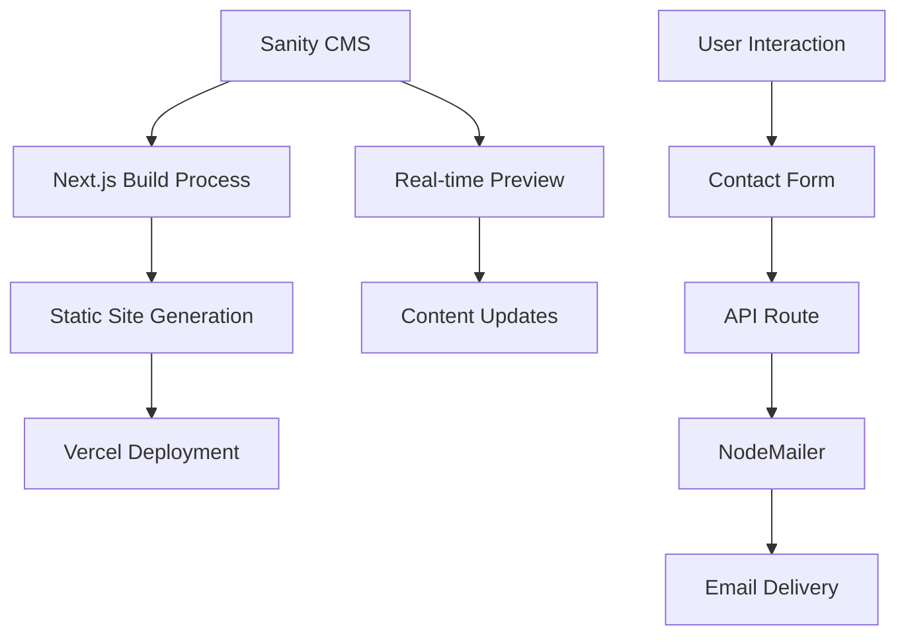

# Design Document: Moment Capturers Portfolio

## Overview

The Moment Capturers portfolio website is a single-page Next.js application showcasing photographer Amey Ghadge's work. The design emphasizes elegant typography, smooth animations, and a content-first approach without traditional navigation. The site uses a headless CMS architecture with Sanity for content management, ensuring the photographer can easily update portfolio items, testimonials, and biographical information.

The design follows a mobile-first responsive approach with carefully crafted animations that enhance user experience without overwhelming the content. The brand identity is reinforced through consistent use of the defined color palette and typography hierarchy.

## Architecture

### Technology Stack

- **Frontend Framework**: Next.js 14 with App Router
- **Styling**: Tailwind CSS with custom brand color configuration
- **Animations**: Framer Motion for scroll-triggered and hover animations
- **Content Management**: Sanity CMS for headless content management
- **Image Gallery**: React Photo Album with masonry layout
- **Lightbox**: Yet Another React Lightbox (YARL)
- **Modal Components**: Headless UI for accessible dialogs
- **Email Service**: NodeMailer with SMTP configuration
- **Deployment**: Vercel with automatic CI/CD

### Application Structure

```
/app
├── layout.js          # Root layout with metadata
├── page.js            # Single-page application entry
├── api/
│   └── contact/
│       └── route.js   # Contact form API endpoint
├── globals.css        # Tailwind imports and custom styles
└── components/
    ├── Landing.js     # Hero section with animated branding
    ├── About.js       # Biography section
    ├── Portfolio.js   # Photography gallery with categories
    ├── Testimonials.js # Auto-rotating testimonials
    ├── ContactButton.js # Floating contact button
    └── ContactModal.js  # Contact form modal
```

### Data Flow Architecture



## Components and Interfaces

### Core Components

#### Landing Section
- **Purpose**: Brand introduction and visual impact
- **Features**: Animated logo, photographer name, tagline
- **Animations**: Fade-in and scale effects on load
- **Layout**: Full viewport height with centered content

#### About Section  
- **Purpose**: Photographer biography and personal connection
- **Data Source**: Sanity CMS "About" document
- **Layout**: Two-column on desktop, single column on mobile
- **Animations**: Fade-in on scroll into view

#### Portfolio Gallery
- **Purpose**: Showcase photography work by category
- **Data Source**: Sanity CMS "Portfolio Item" collection
- **Layout**: Responsive masonry grid using React Photo Album
- **Categories**: Food, Fashion, Events, Corporate, Portrait
- **Features**: 
  - Hover effects with subtle scaling
  - Lightbox integration for full-size viewing
  - Lazy loading with Next.js Image optimization
  - Category filtering/navigation

#### Testimonials Carousel
- **Purpose**: Display client feedback and social proof
- **Data Source**: Sanity CMS "Testimonial" collection
- **Features**:
  - Auto-rotation every 5 seconds
  - Smooth transitions with Framer Motion
  - Client photos and quotes
  - Pause on hover interaction

#### Contact System
- **Components**: ContactButton (floating) + ContactModal (overlay)
- **Features**:
  - Fixed positioning at bottom-right
  - Accessible modal with focus management
  - Form validation and error handling
  - Email integration with confirmation feedback

### Interface Specifications

#### Brand Color System
```javascript
// tailwind.config.js theme extension
colors: {
  accentYellow: '#FFC50F',
  graphite: '#2B2B2B', 
  floralWhite: '#F8F5EE',
  black: '#000000'
}
```

#### Typography Hierarchy
- **Headings**: Custom font stack with fallbacks
- **Body Text**: Optimized for readability across devices
- **Responsive Scaling**: Mobile-first with breakpoint adjustments

#### Animation Specifications
- **Scroll Animations**: Fade-in with 20px Y-offset
- **Hover Effects**: 5% scale increase with smooth transitions
- **Page Load**: Staggered animations for visual hierarchy
- **Performance**: GPU-accelerated transforms only

## Data Models

### Sanity CMS Schema Definitions

#### About Document
```javascript
{
  name: 'about',
  title: 'About Section',
  type: 'document',
  fields: [
    {
      name: 'content',
      type: 'text',
      title: 'Biography Text',
      description: 'Photographer biography and background'
    }
  ]
}
```

#### Portfolio Item Document
```javascript
{
  name: 'portfolioItem',
  title: 'Portfolio Item',
  type: 'document',
  fields: [
    {
      name: 'title',
      type: 'string',
      title: 'Project Title'
    },
    {
      name: 'slug',
      type: 'slug',
      title: 'URL Slug',
      options: { source: 'title' }
    },
    {
      name: 'category',
      type: 'string',
      title: 'Category',
      options: {
        list: ['Food', 'Fashion', 'Events', 'Corporate', 'Portrait']
      }
    },
    {
      name: 'images',
      type: 'array',
      title: 'Images',
      of: [{
        type: 'image',
        options: { hotspot: true },
        fields: [
          {
            name: 'alt',
            type: 'string',
            title: 'Alt Text'
          }
        ]
      }]
    },
    {
      name: 'description',
      type: 'text',
      title: 'Project Description'
    }
  ]
}
```

#### Testimonial Document
```javascript
{
  name: 'testimonial',
  title: 'Testimonial',
  type: 'document',
  fields: [
    {
      name: 'author',
      type: 'string',
      title: 'Client Name'
    },
    {
      name: 'quote',
      type: 'text',
      title: 'Testimonial Quote'
    },
    {
      name: 'image',
      type: 'image',
      title: 'Client Photo',
      options: { hotspot: true }
    },
    {
      name: 'order',
      type: 'number',
      title: 'Display Order'
    }
  ]
}
```

### API Response Formats

#### Portfolio Data Structure
```typescript
interface PortfolioItem {
  _id: string;
  title: string;
  slug: string;
  category: 'Food' | 'Fashion' | 'Events' | 'Corporate' | 'Portrait';
  images: Array<{
    asset: {
      url: string;
      metadata: {
        dimensions: { width: number; height: number; };
      };
    };
    alt: string;
  }>;
  description: string;
}
```

#### Contact Form Data
```typescript
interface ContactFormData {
  name: string;
  email: string;
  message: string;
}

interface ContactResponse {
  success: boolean;
  message: string;
  error?: string;
}
```

Now I need to use the prework tool to analyze the acceptance criteria before writing the correctness properties:

<function_calls>
<invoke name="prework">
<parameter name="featureName">moment-capturers-portfolio

## Correctness Properties

*A property is a characteristic or behavior that should hold true across all valid executions of a system—essentially, a formal statement about what the system should do. Properties serve as the bridge between human-readable specifications and machine-verifiable correctness guarantees.*

Based on the prework analysis, I've identified several properties that can be tested to ensure the website functions correctly. After reviewing for redundancy, the following properties provide unique validation value:

### Property 1: Brand Color Consistency
*For any* section component in the website, all styling should use only the defined brand color classes (accentYellow, graphite, floralWhite, black) and not arbitrary color values.
**Validates: Requirements 1.4**

### Property 2: CMS Data Integration
*For any* CMS content type (About, Portfolio Items, Testimonials), when valid data is provided from the CMS, it should be properly rendered in the corresponding website section.
**Validates: Requirements 3.1, 4.4, 5.1, 5.5, 7.4**

### Property 3: Portfolio Category Organization
*For any* set of portfolio items with different categories, the gallery should group and display them correctly by their category property (Food, Fashion, Events, Corporate, Portrait).
**Validates: Requirements 4.1**

### Property 4: Image Click Interaction
*For any* image in the portfolio gallery, clicking on it should trigger the lightbox functionality to display the full-size image.
**Validates: Requirements 4.3**

### Property 5: Testimonial Carousel Timing
*For any* set of testimonials, the carousel should automatically rotate to the next testimonial every 5 seconds when not paused.
**Validates: Requirements 5.2**

### Property 6: Testimonial Data Rendering
*For any* testimonial with author and quote data, the carousel should display both the author name and quote text, and handle optional client photos gracefully.
**Validates: Requirements 5.3**

### Property 7: Contact Modal Interaction
*For any* user interaction with the contact button, clicking should open an accessible modal with proper focus management and ARIA attributes.
**Validates: Requirements 6.2**

### Property 8: Form Validation
*For any* combination of form inputs (name, email, message), the contact form should validate required fields and provide appropriate error messages for invalid submissions.
**Validates: Requirements 6.4**

### Property 9: Email Sending
*For any* valid contact form submission, the system should send an email to momentcapturers04@gmail.com with the form data and display a success confirmation.
**Validates: Requirements 6.5, 6.6**

### Property 10: Modal Dismissal
*For any* open contact modal, it should close when the user clicks outside the modal area or presses the escape key.
**Validates: Requirements 6.7**

### Property 11: SEO Meta Tags
*For any* page render, the HTML head should include proper meta tags including title, description, and Open Graph data for social sharing.
**Validates: Requirements 8.3**

### Property 12: Image Optimization
*For any* image displayed on the website, it should use the Next.js Image component with proper optimization settings rather than standard img tags.
**Validates: Requirements 8.5**

### Property 13: Responsive Design
*For any* screen size (mobile, tablet, desktop), the website should apply appropriate responsive classes and maintain proper layout and readability.
**Validates: Requirements 9.1, 9.5**

### Property 14: Scroll Animation Setup
*For any* section that should animate on scroll, the elements should have proper Framer Motion whileInView configuration with fade-in effects.
**Validates: Requirements 10.1**

### Property 15: Interactive Hover States
*For any* interactive element (images, buttons, links), hovering should provide visual feedback through CSS transitions or Framer Motion hover states.
**Validates: Requirements 10.2**

### Property 16: Accessibility Animation Compliance
*For any* animation on the website, it should respect the user's prefers-reduced-motion setting and include proper accessibility attributes.
**Validates: Requirements 10.4**

### Property 17: Environment Variable Usage
*For any* sensitive configuration value (API keys, email credentials), the system should read from environment variables rather than hardcoded values.
**Validates: Requirements 12.2**

### Property 18: API Error Handling
*For any* API route request, the system should handle various error conditions (missing data, network failures, validation errors) and return appropriate HTTP status codes and error messages.
**Validates: Requirements 12.4**

## Error Handling

### Client-Side Error Handling

#### Form Validation Errors
- **Missing Required Fields**: Display inline validation messages for empty name, email, or message fields
- **Invalid Email Format**: Validate email format using HTML5 validation and custom regex
- **Network Errors**: Show user-friendly messages when API calls fail
- **Timeout Handling**: Implement request timeouts with retry mechanisms

#### Content Loading Errors
- **CMS Data Failures**: Graceful fallbacks when CMS content fails to load
- **Image Loading Errors**: Placeholder images and retry mechanisms for failed image loads
- **Animation Errors**: Fallback to CSS transitions if Framer Motion fails

#### User Experience Errors
- **Accessibility Failures**: Ensure keyboard navigation works even if JavaScript fails
- **Performance Degradation**: Lazy loading and progressive enhancement strategies
- **Browser Compatibility**: Polyfills and feature detection for older browsers

### Server-Side Error Handling

#### API Route Error Handling
```javascript
// Contact API route error handling
try {
  // Email sending logic
  await transporter.sendMail(mailOptions);
  return NextResponse.json({ success: true, message: 'Email sent successfully' });
} catch (error) {
  console.error('Email sending failed:', error);
  return NextResponse.json(
    { success: false, error: 'Failed to send email' },
    { status: 500 }
  );
}
```

#### CMS Integration Errors
- **Connection Failures**: Retry logic for Sanity API calls
- **Data Validation**: Schema validation for CMS responses
- **Build-Time Errors**: Graceful handling of missing CMS data during static generation

#### Environment Configuration Errors
- **Missing Environment Variables**: Validation and clear error messages
- **Invalid Configuration**: Type checking and validation for environment values
- **Deployment Errors**: Proper error reporting for Vercel deployment issues

### Error Monitoring and Logging

#### Client-Side Monitoring
- **Error Boundaries**: React error boundaries to catch component errors
- **User Feedback**: Error reporting mechanisms for user-reported issues
- **Performance Monitoring**: Core Web Vitals tracking and error correlation

#### Server-Side Logging
- **Structured Logging**: JSON-formatted logs for better parsing
- **Error Aggregation**: Integration with error tracking services
- **Performance Metrics**: API response time and error rate monitoring

## Testing Strategy

### Dual Testing Approach

The testing strategy employs both unit tests and property-based tests to ensure comprehensive coverage:

- **Unit Tests**: Verify specific examples, edge cases, and error conditions
- **Property-Based Tests**: Verify universal properties across all inputs using randomized testing
- **Integration Tests**: Test component interactions and data flow

### Property-Based Testing Configuration

**Testing Library**: Jest with @fast-check/jest for property-based testing
**Test Configuration**: Minimum 100 iterations per property test
**Test Organization**: Each correctness property implemented as a single property-based test

#### Property Test Tagging Format
Each property test must include a comment referencing the design document:
```javascript
// Feature: moment-capturers-portfolio, Property 1: Brand Color Consistency
```

### Unit Testing Strategy

#### Component Testing
- **Landing Section**: Test brand name display, animation setup, styling classes
- **About Section**: Test CMS data rendering, responsive layout classes
- **Portfolio Gallery**: Test category organization, image optimization, lightbox integration
- **Testimonials**: Test data rendering, carousel timing, animation transitions
- **Contact System**: Test form validation, modal behavior, accessibility

#### API Testing
- **Contact Endpoint**: Test email sending, validation, error handling
- **CMS Integration**: Test data fetching, error handling, response formatting

#### Integration Testing
- **End-to-End Flows**: Contact form submission, portfolio browsing, responsive behavior
- **CMS Integration**: Content updates reflecting in the website
- **Performance Testing**: Image loading, animation performance, Core Web Vitals

### Testing Tools and Configuration

#### Primary Testing Stack
- **Jest**: Unit testing framework with React Testing Library
- **@fast-check/jest**: Property-based testing library
- **Playwright**: End-to-end testing for user interactions
- **Lighthouse CI**: Performance and accessibility testing

#### Test Environment Setup
```javascript
// jest.config.js
module.exports = {
  testEnvironment: 'jsdom',
  setupFilesAfterEnv: ['<rootDir>/jest.setup.js'],
  moduleNameMapping: {
    '^@/(.*)$': '<rootDir>/$1',
  },
  collectCoverageFrom: [
    'app/**/*.{js,jsx}',
    'components/**/*.{js,jsx}',
    '!**/*.d.ts',
  ],
};
```

#### Property Test Configuration
```javascript
// Property test example with proper configuration
import fc from 'fast-check';

// Feature: moment-capturers-portfolio, Property 1: Brand Color Consistency
test('Brand color consistency across components', () => {
  fc.assert(fc.property(
    fc.constantFrom('Landing', 'About', 'Portfolio', 'Testimonials', 'Contact'),
    (componentName) => {
      const component = renderComponent(componentName);
      const colorClasses = extractColorClasses(component);
      return colorClasses.every(cls => 
        ['accentYellow', 'graphite', 'floralWhite', 'black'].some(brand => 
          cls.includes(brand)
        )
      );
    }
  ), { numRuns: 100 });
});
```

### Continuous Integration Testing

#### Pre-deployment Checks
- All unit tests must pass
- Property-based tests must complete 100 iterations successfully
- Lighthouse performance scores must meet thresholds
- Accessibility tests must pass WCAG 2.1 AA standards

#### Performance Testing
- **Core Web Vitals**: LCP < 2.5s, FID < 100ms, CLS < 0.1
- **Image Optimization**: Verify Next.js Image optimization is working
- **Bundle Size**: Monitor JavaScript bundle size and code splitting effectiveness